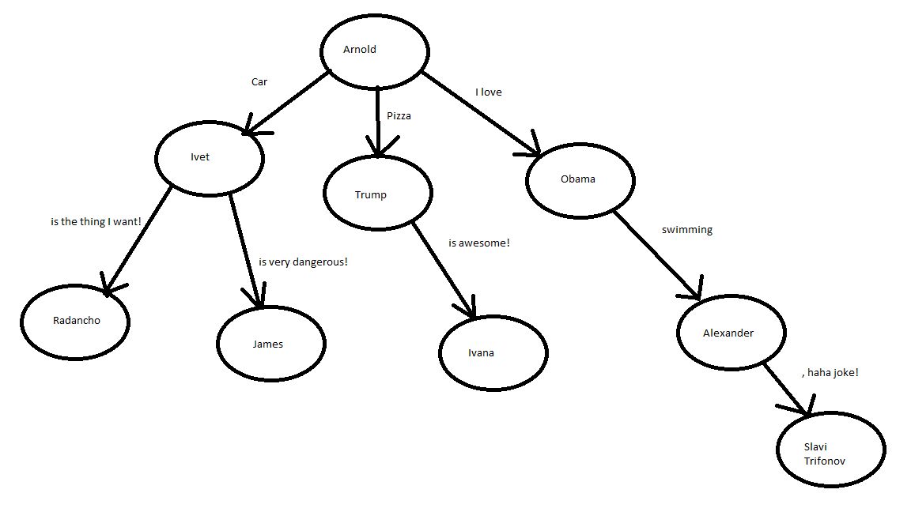

# 06.01.2019
# HAPPY NEW YEAR!

### What are we going to talk about today?
1. Sets and key-value data structures
2. Implementations with hash functions, hash tables and binary search tree
3. Collision mechanism - separate chaining(linked lists) and open addresing(linear probing)

### Task descriptions
1. See how the STL containers work - set, unordered_set, map, unordered_map;
2. Given a sequence of N numbers, return the number of unique ones;
3. Count the number of occurences of each word within a sentence;
4. Given a sequence of N numbers, get the first one which is contained more than once;
5. Build a tree with weighted edges
    -   every edge will have a label which is a string;
    -   every node can have multiple children(more than 2);
    -   every node has as a value the person(string) who told the words following from this node(all the edge labels going out of the node);
    -   leaf node will be a node without children;
    -   make a method, which given a sentence returns if there is a path from the root to a leaf node which describe exactly this sentence. Return the chain of people who made the words;
    -   consider that every two labels should be concatenated with a single space;
    
    - for example in the given tree "Car is the thing I want" is inside the tree with chain Arnold -> Ivet -> Radancho. SDP is an awesome subject is not inside the tree;

### Tips: 
1. use map/hash map to represent the edges comming out of a specific node;
2. use the iterators, so you go through the edges;
3. if we force every label to be a single word(car, drive, carefully), can we search faster and use the map/hash map more efficiently?